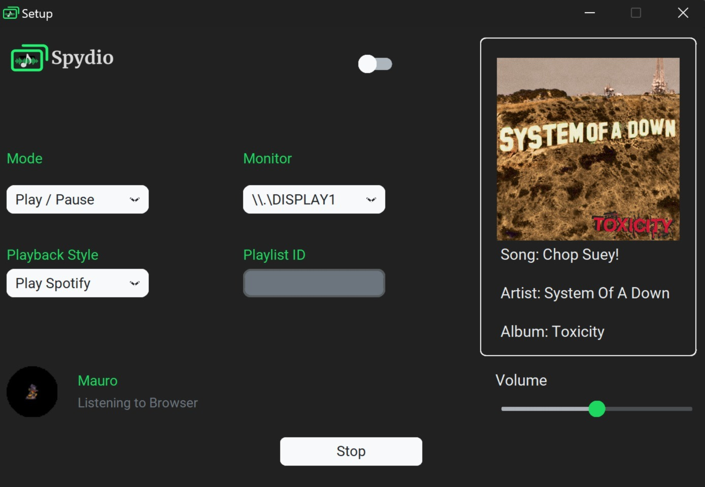

> 📌 **Upcoming Update – Version 3.0 Coming in July**  
> Spydio 3.0 is on the way with a **refined user experience**, **improved performance**, and a **new installer**.  
> I'm transitioning away from Inno Setup due to false virus detections by some browsers.  
> The new version will use a more robust and trusted alternative (likely **NSIS** or **WiX Toolset**) for a smoother and safer installation process.

# Spydio (**sp**: <ins>sp</ins>otify, **py**: <ins>py</ins>thon, **dio**: au<ins>dio</ins>)

Spydio is a tool designed to seamlessly manage Spotify playback based on the audio status of your web browser. It now features a user-friendly graphical interface, eliminating the need for console interactions and making it easier than ever to enjoy uninterrupted music.

## Features

- Automatically detects if the browser is playing or muted.
- Pauses or resumes Spotify playback based on the browser's audio state.
- Easy-to-use graphical interface for setup and controls.
- Multi-monitor support with click detection to ensure browser audio state is accurately tracked.
- Configurable playback modes and settings for a personalized experience.
- Runs efficiently in the background.

## Installation

Spydio is distributed as an installer for Windows, making the setup process straightforward and hassle-free.

### 1. Download and Install

1. Download the latest Spydio installer from the [Releases](https://github.com/mauuroo/Spydio/releases) section on GitHub.
2. Run the installer (`SpydioSetup.exe`) and follow the on-screen instructions.
3. Once installed, launch Spydio from the Start Menu or Desktop shortcut.

### 2. Spotify Account Configuration

Spydio requires your Spotify credentials to interact with your account. Follow these steps to set up:

1. **Log in to your Spotify account**:
   - Visit the [Spotify for Developers](https://developer.spotify.com) website.

2. **Create an Application**:
   - Navigate to the [Spotify Developer Dashboard](https://developer.spotify.com/dashboard/applications).
   - Click **"Create an App"**, provide the necessary details, and set the "Redirect URI" to `http://127.0.0.1:8888/callback`.
   - Mark the **"Web API"** option.
   - Copy the **Client ID** and **Client Secret** from your app's settings.

3. **Configure Spydio**:
   - When opening Spydio for the first time, a window will appear where you will need to enter your Client ID and Client Secret in the designated fields.
   - After entering the credentials, click "Save".
   
   > **Note:** When entering credentials for the first time or if they are invalid, temporary URLs will open in your browser for verification purposes. This behavior is normal and ensures proper authentication with Spotify.

## How to Use

Spydio provides a customizable interface with the following settings:

### Main Configurations

1. **Mode**:
   - Choose between:
     - **Play/Pause**: Controls playback based on browser audio state.
     - **Volume Increase / Volume Decrease**: Gradually increases the audio when the browser is muted and decreases it without pausing when the navigator is playing.
2. **Monitor**:
   - Select the monitor where you will play multimedia content.
   - Assign the monitor Spydio will monitor to analyze playback data.
   - **To change the monitor**, you must first stop the program using the "Stop" button and then restart it after selecting the new monitor

3. **Playback Style**:
   - **Select Playlist**: Requires a playlist URL to play specific playlists.
   - **Play Mode**: Plays Spotify using your last queue.

4. **Playlist ID**:
   - Enter the Spotify URL for the playlist you want to play (only applicable if **Playback Style** is set to "Select Playlist").

5. **Credentials**
   - In the upper middle part of the window, you’ll find a switch that allows you to change your **Client ID** and **Client Secret** if needed. Toggle it to update your credentials.
### General Steps

1. Launch Spydio and configure the settings according to your preferences.
2. Open your web browser and start streaming audio.
3. Spydio will manage Spotify playback based on your selected mode and browser activity:
   - **When browser audio is paused/muted**: Spotify playback will resume (or volume will increase).
   - **When browser audio is active**: Spotify playback will pause (or volume will decrease).

## Support

If you encounter issues or have suggestions, please:
- Open an issue on the [GitHub Issues](https://github.com/mauuroo/Spydio/issues) page.
- Or email: **mfernandezar@usm.cl**.

## License

This project is licensed under the MIT License. See the [LICENSE](LICENSE) file for details.
